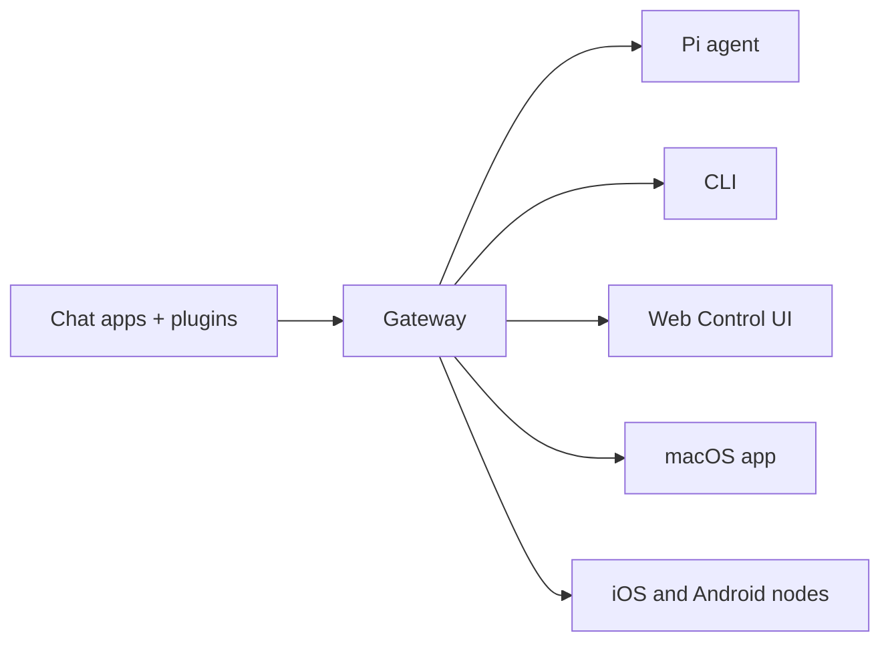

# 📋 Product Requirements Document for the original OpenClaw

---

## 1. Product Overview

**OpenClaw** is a self-hosted, open-source (MIT) gateway that bridges popular messaging apps to AI coding agents. It runs on any OS, is installable with a single `npm install -g openclaw@latest`, and is designed for developers and power users who want a personal AI assistant available from anywhere — without surrendering data to a hosted service.

> *"Any OS gateway for AI agents across WhatsApp, Telegram, Discord, iMessage, and more."* [1](#0-0) 

---

## 2. Problem Statement

Existing AI assistants are cloud-hosted, opinionated about which interface you use, and own your data. Developers want:

- To use **the chat app already in their pocket** (WhatsApp, Telegram, Discord…)
- To run **their own hardware**, their own rules
- An agent that has **memory**, uses **tools**, and can **code** — not just chat
- The ability to extend and plugin capabilities as needed

---

## 3. Target Users

- Developers & power users wanting a personal AI assistant reachable from any messaging app
- Teams/families running isolated multi-agent setups from one server
- Self-hosters who want no vendor lock-in and full data ownership

---

## 4. Core Feature Areas

---

### Feature 1: The Gateway — Single Source of Truth

The **Gateway** is the central long-lived process. It owns all messaging surfaces, routes messages to agents, and exposes a typed WebSocket API.

Key properties:
- One Gateway per host; it is the only process that opens a WhatsApp Baileys session.
- Control-plane clients (macOS app, CLI, Web UI) connect over WebSocket on the configured bind host (default `127.0.0.1:18789`).
- Validates inbound frames against JSON Schema.
- Emits typed events: `agent`, `chat`, `presence`, `health`, `heartbeat`, `cron`.
- Handshake is mandatory; any non-JSON or non-`connect` first frame is a hard close.
- Idempotency keys required for all side-effecting methods to safely retry. [2](#0-1) [3](#0-2) 

---

### Feature 2: Multi-Channel Support

A **single Gateway** simultaneously serves all channels. Channels can run in parallel; routing is deterministic.

**Natively built-in:**
- **WhatsApp** via Baileys (QR pairing, most popular)
- **Telegram** via grammY (simplest setup — just a bot token)
- **Discord** via Discord Bot API + Gateway
- **iMessage** / **BlueBubbles** (macOS, recommended for iMessage)
- **Signal** via signal-cli
- **Slack** via Bolt SDK
- **IRC**

**Plugin channels (installed separately):**
Mattermost, Microsoft Teams, LINE, Matrix, Feishu, Google Chat, Nextcloud Talk, Nostr, Tlon/Urbit, Twitch, Synology Chat, Zalo, Zalo Personal

**WebChat:** static browser UI served directly by the Gateway, using the same WebSocket API. [4](#0-3) [5](#0-4) 

---

### Feature 3: Multi-Agent Routing with Isolated Sessions

This is arguably OpenClaw's most powerful capability. Multiple isolated **agents** (each with their own workspace, auth, sessions, persona) can run simultaneously in one Gateway, with inbound messages deterministically routed via **bindings**.

**What one agent is:**
- Its own workspace (files, `SOUL.md`, `AGENTS.md`, `USER.md`)
- Its own `agentDir` (auth profiles, model registry)
- Its own session store

**Routing resolution order (most-specific wins):**
1. `peer` match (exact DM/group/channel id)
2. `parentPeer` match
3. `guildId + roles`
4. `guildId`
5. `teamId`
6. `accountId` match for a channel
7. channel-level match (`accountId: "*"`)
8. Fallback to default agent

**Real-world use cases:**
- Multiple WhatsApp phone numbers → different agents
- WhatsApp for daily chat, Telegram for deep work (different model per agent)
- Family bot bound to a specific group, with tighter tool policy
- One WhatsApp number, DMs split per sender to different agents [6](#0-5) [7](#0-6) 

---

### Feature 4: Agent Runtime & Workspace

OpenClaw runs an embedded agent runtime (derived from **pi-mono**) with tool use, streaming, and session management — **all owned by OpenClaw** (not pi-coding-agent defaults).

**Workspace layout** (plain files on disk, git-backable):

| File | Purpose |
|---|---|
| `AGENTS.md` | Operating instructions, rules, priorities |
| `SOUL.md` | Persona, tone, and boundaries |
| `USER.md` | Who the user is |
| `IDENTITY.md` | Agent name, vibe, emoji |
| `TOOLS.md` | Local tool notes |
| `HEARTBEAT.md` | Heartbeat run checklist |
| `MEMORY.md` | Curated long-term memory |
| `memory/YYYY-MM-DD.md` | Daily append-only log |
| `skills/` | Workspace-specific skills |
| `canvas/` | Canvas UI files |

All bootstrap files are injected into the system prompt at session start, with per-file and total size caps. [8](#0-7) [9](#0-8) 

---

### Feature 5: Memory System (Markdown + Semantic Search)

Memory is **plain Markdown on disk** — the source of truth. The model only "remembers" what gets written to disk.

**Memory layers:**
- `memory/YYYY-MM-DD.md` — daily append-only log
- `MEMORY.md` — curated long-term memory (main session only)

**Memory search tools available to the agent:**
- `memory_search` — hybrid semantic recall (BM25 + vector similarity)
- `memory_get` — targeted read of a specific Markdown file/line range

**Advanced memory capabilities:**
- **Hybrid search** (BM25 keyword + vector cosine similarity), merged with configurable weights
- **Temporal decay** — exponential score decay for dated files (configurable half-life, default 30 days); evergreen files never decay
- **MMR re-ranking** — Maximal Marginal Relevance to reduce near-duplicate results
- **Embedding providers:** OpenAI, Gemini, Voyage, Mistral, Ollama, local (node-llama-cpp GGUF), or custom OpenAI-compatible endpoint
- **QMD backend** (experimental) — local-first BM25+vector+reranking sidecar
- **Multimodal memory** — index image and audio files when using Gemini Embedding 2
- **Pre-compaction memory flush** — silent agentic turn writes durable notes before context is compacted [10](#0-9) [11](#0-10) [12](#0-11) 

---

### Feature 6: Session Management

Sessions are the atomic unit of conversation context.

**DM scope options:**
- `main` (default) — all DMs share one session for continuity
- `per-peer` — isolate by sender id
- `per-channel-peer` — recommended for multi-user inboxes
- `per-account-channel-peer` — recommended for multi-account inboxes

**Session lifecycle:**
- Daily reset at 4:00 AM local time (configurable)
- Idle reset (optional sliding window)
- Per-type overrides (`direct`, `group`, `thread`)
- Per-channel overrides
- `/new`, `/reset`, `/compact` slash commands in-chat

**Session key taxonomy:**

| Type | Key Pattern |
|---|---|
| Direct (main) | `agent:<id>:<mainKey>` |
| Direct (per-peer) | `agent:<id>:direct:<peerId>` |
| Group | `agent:<id>:<channel>:group:<id>` |
| Cron | `cron:<job.id>` |
| Sub-agent | `agent:<id>:subagent:<uuid>` |

**Maintenance:** configurable prune-after, max entries, rotate bytes, hard disk budget. [13](#0-12) [14](#0-13) 

---

### Feature 7: Context Window & Compaction

Long sessions are handled gracefully.

- **Auto-compaction** (default on): when a session nears the context window, older history is summarized into a compact entry and persisted in JSONL.
- **Manual compaction**: `/compact [optional instructions]`
- **Compaction model override**: can use a different (cheaper) model for summarization
- **Pre-compaction memory flush** (see Feature 5): silent turn writes memory before compaction
- **Session pruning**: trims old tool results in-memory before LLM calls (does not rewrite JSONL)
- **OpenAI server-side compaction** also supported alongside local compaction [15](#0-14) 

---

### Feature 8: Model Provider Flexibility

OpenClaw ships with a **pi-ai catalog** and supports a wide ecosystem of providers via `provider/model` refs.

**Built-in providers (no extra config needed):**
- OpenAI (`openai/gpt-5.4`)
- Anthropic (`anthropic/claude-opus-4-6`)
- OpenAI Code / Codex (`openai-codex/gpt-5.4`)
- OpenCode (Zen and Go runtimes)
- Google Gemini API key
- Google Vertex, Antigravity, Gemini CLI (plugin)
- xAI, Mistral, Groq, Cerebras
- OpenRouter, Kilo Gateway, Vercel AI Gateway
- GitHub Copilot, Hugging Face Inference
- Z.AI (GLM), Volcano Engine (Doubao), BytePlus

**Custom / local providers (via `models.providers`):**
- Ollama, vLLM, SGLang, LM Studio, LiteLLM
- Any OpenAI-compatible or Anthropic-compatible proxy
- Moonshot (Kimi), MiniMax, Qwen (OAuth free tier), Synthetic, BytePlus

**API key rotation:** supports multiple keys, rotates on rate-limit (429) responses. [16](#0-15) [17](#0-16) 

---

### Feature 9: Skills & ClawHub Ecosystem

Skills teach the agent how to use tools. Each skill is a directory with a `SKILL.md` (YAML frontmatter + instructions), following the **AgentSkills spec**.

**Three loading locations** (workspace wins on name conflict):
1. Bundled (shipped with install)
2. Managed/local: `~/.openclaw/skills`
3. Workspace: `<workspace>/skills`

**Gating at load time:** by required binaries, env vars, config keys, OS platform.

**ClawHub** is the public skills registry:
- Browse at [clawhub.ai](https://clawhub.ai)
- `clawhub install <skill-slug>` / `clawhub update --all` / `clawhub sync --all`
- Versioned, publicly searchable, free

Per-agent skills: each agent has its own workspace skills, with shared skills available from `~/.openclaw/skills`. [18](#0-17) [19](#0-18) 

---

### Feature 10: Sub-Agents & Orchestration

Agents can spawn **sub-agents** — isolated background runs that announce results back to the requester channel.

- Sub-agents run in their own session key (`agent:<id>:subagent:<uuid>`)
- **Orchestrator pattern** supported: main → orchestrator (depth 1) → workers (depth 2), up to `maxSpawnDepth: 5`
- **Thread-bound sessions** (Discord): sub-agent stays bound to a thread; follow-up messages route to the same sub-agent
- **Cascade stop**: `/stop` aborts the requester and all its sub-agent children
- **Tool policy by depth**: orchestrators get session management tools; leaf workers do not
- Concurrency cap via `maxConcurrent` (default 8) and `maxChildrenPerAgent` (default 5) [20](#0-19) [21](#0-20) 

---

### Feature 11: Sandboxing (Docker-based Tool Isolation)

Tool execution can be isolated in Docker containers to reduce blast radius.

**Modes:**
- `off` — no sandboxing (default)
- `non-main` — sandbox only non-main sessions (groups, threads, etc.)
- `all` — every session sandboxed

**Scope:**
- `session` — one container per session
- `agent` — one container per agent
- `shared` — one shared container

**Workspace access:** `none` (sandbox-only), `ro` (read-only mount), `rw` (read-write mount)

**Sandboxed browser:** dedicated Chromium in container, with CDP access, noVNC observer, SSRF policy, and optional allowlists.

Per-agent sandbox overrides supported: different agents can have different sandbox policies and tool restrictions. [22](#0-21) [23](#0-22) 

---

### Feature 12: Mobile Nodes (iOS & Android)

**Nodes** are companion devices (macOS/iOS/Android/headless) that connect to the Gateway WebSocket with `role: node` and expose a rich command surface.

**iOS node capabilities:**
- Canvas (WebView), camera, screen recording, location, voice features, pairing

**Android node capabilities:**
- Connect tab, chat sessions, voice tab, Canvas/camera
- Device commands: `device.status`, `device.info`, `device.health`
- Notifications: `notifications.list`, `notifications.actions`
- Personal data: contacts, calendar, photos, motion/pedometer
- SMS send (`sms.send`)

**All nodes expose:**
- `canvas.*` — WebView control, snapshot, A2UI push, navigation
- `camera.*` — photo snap, video clip
- `screen.record` — mp4 screen recording
- `location.get` — GPS coordinates
- `system.run` / `system.notify` — shell execution + desktop notifications

Node pairing is device-based and requires explicit approval. Local connects (loopback) can be auto-approved. [24](#0-23) [25](#0-24) 

---

### Feature 13: Web Control UI (Browser Dashboard)

A **Vite + Lit** single-page app served by the Gateway (default `http://127.0.0.1:18789/`).

**Capabilities:**
- Chat with model via Gateway WS with live streaming tool output cards
- Channels: status, QR login, per-channel config
- Sessions: list, per-session model/thinking/verbose overrides
- Cron jobs: add/edit/run/enable/disable + run history
- Skills: enable/disable, install, API key updates
- Nodes: list + caps
- Exec approvals: edit gateway or node allowlists
- Config: view/edit `openclaw.json` with schema-driven form + raw JSON editor
- Logs: live tail with filter/export
- Updates: run package update + restart

**Remote access options:**
- Tailscale Serve (recommended, HTTPS)
- SSH tunnel (port forward)
- Bind to tailnet + token

**Multi-language UI:** en, zh-CN, zh-TW, pt-BR, de, es [26](#0-25) [27](#0-26) 

---

### Feature 14: Security Model

OpenClaw is designed as a **personal assistant security model** — one trusted operator boundary, potentially many agents.

**Key security surfaces:**
- Gateway auth: token or password, required on `connect` handshake
- **Device pairing**: all WS clients (operators + nodes) present a device identity; new IDs require approval
- Signature payload `v3` binds `platform + deviceFamily`; re-pairing required on metadata change
- Channel allowlists: `allowFrom`, `dmPolicy` (`open`/`pairing`/`allowlist`), `groupPolicy`
- Tool policy: global allow/deny lists, per-agent overrides, per-session overrides
- Exec approvals: `ask`/`allowlist`/`full` modes for shell execution
- Sandboxing: Docker isolation for tool execution (see Feature 11)
- `openclaw security audit` CLI command for automated config review

**Important boundary:** OpenClaw is **not** a hostile multi-tenant security boundary. For adversarial-user isolation, separate gateways (ideally separate OS users/hosts) are required. [28](#0-27) 

---

### Feature 15: Agent-Managed Browser

OpenClaw can run a **dedicated Chromium/Brave/Edge profile** controlled by the agent, isolated from the user's personal browser.

- Deterministic tab control (list/open/focus/close)
- Agent actions: click/type/drag/select, snapshots, screenshots, PDFs
- Multiple profiles: `openclaw` (managed/isolated), `chrome` (system browser via extension relay), `existing-session` (Chrome MCP attach)
- SSRF policy controls (default: trusted-network mode)
- Optional sandboxed browser in Docker container [29](#0-28) 

---

### Feature 16: Guided Setup & Onboarding

Designed for a sub-5-minute time-to-first-agent:

```
npm install -g openclaw@latest
openclaw onboard --install-daemon
openclaw channels login
openclaw gateway --port 18789
```

- `openclaw onboard` — interactive wizard (model provider, channel, workspace init)
- `openclaw configure` / `openclaw setup` — config wizard and workspace seeding
- Hot-reload: Gateway watches `openclaw.json` and applies changes automatically
- `openclaw doctor` / `openclaw doctor --fix` — config validation and repair
- Strict schema validation: unknown keys cause the Gateway to refuse to start [30](#0-29) [31](#0-30) 

---

## 5. System Architecture Summary

```mermaid
flowchart TD
  "Chat Apps (WhatsApp, Telegram, Discord, iMessage, Signal, Slack, ...)" --> "Gateway (WebSocket server, port 18789)"
  "Plugin Channels (Mattermost, Teams, LINE, Matrix, ...)" --> "Gateway (WebSocket server, port 18789)"
  "Gateway (WebSocket server, port 18789)" --> "Agent Runtime (pi-mono embedded)"
  "Agent Runtime (pi-mono embedded)" --> "Workspace (Markdown files, Memory, Skills)"
  "Agent Runtime (pi-mono embedded)" --> "Session Store (JSONL transcripts)"
  "Agent Runtime (pi-mono embedded)" --> "Model Providers (OpenAI, Anthropic, Gemini, Ollama, ...)"
  "Gateway (WebSocket server, port 18789)" --> "Control UI (Vite + Lit SPA)"
  "Gateway (WebSocket server, port 18789)" --> "CLI (openclaw)"
  "Gateway (WebSocket server, port 18789)" --> "macOS App"
  "Gateway (WebSocket server, port 18789)" --> "iOS / Android Nodes"
  "Agent Runtime (pi-mono embedded)" --> "Sandbox (Docker containers, optional)"
  "Agent Runtime (pi-mono embedded)" --> "Sub-Agents (isolated sessions)"
``` [32](#0-31) [33](#0-32) 

---

## 6. Non-Functional Requirements

| Requirement | Detail |
|---|---|
| **Self-hosted** | Runs on any OS (macOS, Linux, Windows/WSL) |
| **Runtime** | Node 24 recommended; Node 22 LTS (`22.16+`) minimum |
| **Install** | Single `npm install -g openclaw@latest` |
| **Config** | JSON5 file at `~/.openclaw/openclaw.json`; schema-validated; hot-reload |
| **State isolation** | Per-agent: workspace, sessions, auth profiles, memory |
| **Open source** | MIT licensed, community-driven |
| **Extensibility** | Plugin system for channels, providers, auth flows, and skills (ClawHub) |
| **Remote access** | Tailscale Serve (HTTPS) or SSH tunnel |
| **Observability** | `openclaw doctor`, `openclaw health`, `openclaw status`, live log tail in UI | [34](#0-33) [35](#0-34) 

---

## Notes

1. **Pi is the only coding agent path** today. Legacy Claude, Codex, Gemini, and Opencode direct agent paths have been removed; OpenClaw uses pi-mono as the embedded agent runtime. [36](#0-35) 

2. **Security model caveat**: OpenClaw is explicitly *not* designed as a hostile multi-tenant bus. If multiple adversarial users share one gateway, they share delegated tool authority. The recommendation is one gateway per trust boundary. [37](#0-36) 

3. **ClawHub** is a separate service (`clawhub.ai`) maintained alongside the core project; skill contributions go there, not to the core repo. [38](#0-37) 

4. **Protocol typing**: TypeBox schemas define the wire protocol; JSON Schema is generated from them, and Swift models are code-generated from JSON Schema — enabling type-safe iOS/macOS client development. [39](#0-38)

### Citations

**File:** docs/index.md (L1-58)
```markdown
---
summary: "OpenClaw is a multi-channel gateway for AI agents that runs on any OS."
read_when:
  - Introducing OpenClaw to newcomers
title: "OpenClaw"
---

# OpenClaw 🦞

<p align="center">
    
    
</p>

> _"EXFOLIATE! EXFOLIATE!"_ — A space lobster, probably

<p align="center">
  <strong>Any OS gateway for AI agents across WhatsApp, Telegram, Discord, iMessage, and more.</strong><br />
  Send a message, get an agent response from your pocket. Plugins add Mattermost and more.
</p>

<Columns>
  <Card title="Get Started" href="/start/getting-started" icon="rocket">
    Install OpenClaw and bring up the Gateway in minutes.
  </Card>
  <Card title="Run the Wizard" href="/start/wizard" icon="sparkles">
    Guided setup with `openclaw onboard` and pairing flows.
  </Card>
  <Card title="Open the Control UI" href="/web/control-ui" icon="layout-dashboard">
    Launch the browser dashboard for chat, config, and sessions.
  </Card>
</Columns>

## What is OpenClaw?

OpenClaw is a **self-hosted gateway** that connects your favorite chat apps — WhatsApp, Telegram, Discord, iMessage, and more — to AI coding agents like Pi. You run a single Gateway process on your own machine (or a server), and it becomes the bridge between your messaging apps and an always-available AI assistant.

**Who is it for?** Developers and power users who want a personal AI assistant they can message from anywhere — without giving up control of their data or relying on a hosted service.

**What makes it different?**

- **Self-hosted**: runs on your hardware, your rules
- **Multi-channel**: one Gateway serves WhatsApp, Telegram, Discord, and more simultaneously
- **Agent-native**: built for coding agents with tool use, sessions, memory, and multi-agent routing
- **Open source**: MIT licensed, community-driven

**What do you need?** Node 24 (recommended), or Node 22 LTS (`22.16+`) for compatibility, an API key from your chosen provider, and 5 minutes. For best quality and security, use the strongest latest-generation model available.

```

**File:** docs/index.md (L59-70)
```markdown
## How it works



```

**File:** docs/index.md (L97-118)
```markdown

<Steps>
  <Step title="Install OpenClaw">
    ```bash
    npm install -g openclaw@latest
    ```
  </Step>
  <Step title="Onboard and install the service">
    ```bash
    openclaw onboard --install-daemon
    ```
  </Step>
  <Step title="Pair WhatsApp and start the Gateway">
    ```bash
    openclaw channels login
    openclaw gateway --port 18789
    ```
  </Step>
</Steps>

Need the full install and dev setup? See [Quick start](/start/quickstart).

```

**File:** docs/concepts/architecture.md (L13-55)
```markdown

- A single long‑lived **Gateway** owns all messaging surfaces (WhatsApp via
  Baileys, Telegram via grammY, Slack, Discord, Signal, iMessage, WebChat).
- Control-plane clients (macOS app, CLI, web UI, automations) connect to the
  Gateway over **WebSocket** on the configured bind host (default
  `127.0.0.1:18789`).
- **Nodes** (macOS/iOS/Android/headless) also connect over **WebSocket**, but
  declare `role: node` with explicit caps/commands.
- One Gateway per host; it is the only place that opens a WhatsApp session.
- The **canvas host** is served by the Gateway HTTP server under:
  - `/__openclaw__/canvas/` (agent-editable HTML/CSS/JS)
  - `/__openclaw__/a2ui/` (A2UI host)
    It uses the same port as the Gateway (default `18789`).

## Components and flows

### Gateway (daemon)

- Maintains provider connections.
- Exposes a typed WS API (requests, responses, server‑push events).
- Validates inbound frames against JSON Schema.
- Emits events like `agent`, `chat`, `presence`, `health`, `heartbeat`, `cron`.

### Clients (mac app / CLI / web admin)

- One WS connection per client.
- Send requests (`health`, `status`, `send`, `agent`, `system-presence`).
- Subscribe to events (`tick`, `agent`, `presence`, `shutdown`).

### Nodes (macOS / iOS / Android / headless)

- Connect to the **same WS server** with `role: node`.
- Provide a device identity in `connect`; pairing is **device‑based** (role `node`) and
  approval lives in the device pairing store.
- Expose commands like `canvas.*`, `camera.*`, `screen.record`, `location.get`.

Protocol details:

- [Gateway protocol](/gateway/protocol)

### WebChat

- Static UI that uses the Gateway WS API for chat history and sends.
```

**File:** docs/concepts/architecture.md (L80-110)
```markdown
## Wire protocol (summary)

- Transport: WebSocket, text frames with JSON payloads.
- First frame **must** be `connect`.
- After handshake:
  - Requests: `{type:"req", id, method, params}` → `{type:"res", id, ok, payload|error}`
  - Events: `{type:"event", event, payload, seq?, stateVersion?}`
- If `OPENCLAW_GATEWAY_TOKEN` (or `--token`) is set, `connect.params.auth.token`
  must match or the socket closes.
- Idempotency keys are required for side‑effecting methods (`send`, `agent`) to
  safely retry; the server keeps a short‑lived dedupe cache.
- Nodes must include `role: "node"` plus caps/commands/permissions in `connect`.

## Pairing + local trust

- All WS clients (operators + nodes) include a **device identity** on `connect`.
- New device IDs require pairing approval; the Gateway issues a **device token**
  for subsequent connects.
- **Local** connects (loopback or the gateway host’s own tailnet address) can be
  auto‑approved to keep same‑host UX smooth.
- All connects must sign the `connect.challenge` nonce.
- Signature payload `v3` also binds `platform` + `deviceFamily`; the gateway
  pins paired metadata on reconnect and requires repair pairing for metadata
  changes.
- **Non‑local** connects still require explicit approval.
- Gateway auth (`gateway.auth.*`) still applies to **all** connections, local or
  remote.

Details: [Gateway protocol](/gateway/protocol), [Pairing](/channels/pairing),
[Security](/gateway/security).

```

**File:** docs/concepts/architecture.md (L112-117)
```markdown

- TypeBox schemas define the protocol.
- JSON Schema is generated from those schemas.
- Swift models are generated from the JSON Schema.

## Remote access
```

**File:** docs/channels/index.md (L15-47)
```markdown

- [BlueBubbles](/channels/bluebubbles) — **Recommended for iMessage**; uses the BlueBubbles macOS server REST API with full feature support (edit, unsend, effects, reactions, group management — edit currently broken on macOS 26 Tahoe).
- [Discord](/channels/discord) — Discord Bot API + Gateway; supports servers, channels, and DMs.
- [Feishu](/channels/feishu) — Feishu/Lark bot via WebSocket (plugin, installed separately).
- [Google Chat](/channels/googlechat) — Google Chat API app via HTTP webhook.
- [iMessage (legacy)](/channels/imessage) — Legacy macOS integration via imsg CLI (deprecated, use BlueBubbles for new setups).
- [IRC](/channels/irc) — Classic IRC servers; channels + DMs with pairing/allowlist controls.
- [LINE](/channels/line) — LINE Messaging API bot (plugin, installed separately).
- [Matrix](/channels/matrix) — Matrix protocol (plugin, installed separately).
- [Mattermost](/channels/mattermost) — Bot API + WebSocket; channels, groups, DMs (plugin, installed separately).
- [Microsoft Teams](/channels/msteams) — Bot Framework; enterprise support (plugin, installed separately).
- [Nextcloud Talk](/channels/nextcloud-talk) — Self-hosted chat via Nextcloud Talk (plugin, installed separately).
- [Nostr](/channels/nostr) — Decentralized DMs via NIP-04 (plugin, installed separately).
- [Signal](/channels/signal) — signal-cli; privacy-focused.
- [Synology Chat](/channels/synology-chat) — Synology NAS Chat via outgoing+incoming webhooks (plugin, installed separately).
- [Slack](/channels/slack) — Bolt SDK; workspace apps.
- [Telegram](/channels/telegram) — Bot API via grammY; supports groups.
- [Tlon](/channels/tlon) — Urbit-based messenger (plugin, installed separately).
- [Twitch](/channels/twitch) — Twitch chat via IRC connection (plugin, installed separately).
- [WebChat](/web/webchat) — Gateway WebChat UI over WebSocket.
- [WhatsApp](/channels/whatsapp) — Most popular; uses Baileys and requires QR pairing.
- [Zalo](/channels/zalo) — Zalo Bot API; Vietnam's popular messenger (plugin, installed separately).
- [Zalo Personal](/channels/zalouser) — Zalo personal account via QR login (plugin, installed separately).

## Notes

- Channels can run simultaneously; configure multiple and OpenClaw will route per chat.
- Fastest setup is usually **Telegram** (simple bot token). WhatsApp requires QR pairing and
  stores more state on disk.
- Group behavior varies by channel; see [Groups](/channels/groups).
- DM pairing and allowlists are enforced for safety; see [Security](/gateway/security).
- Troubleshooting: [Channel troubleshooting](/channels/troubleshooting).
- Model providers are documented separately; see [Model Providers](/providers/models).
```

**File:** docs/concepts/features.md (L32-53)
```markdown

- WhatsApp integration via WhatsApp Web (Baileys)
- Telegram bot support (grammY)
- Discord bot support (channels.discord.js)
- Mattermost bot support (plugin)
- iMessage integration via local imsg CLI (macOS)
- Agent bridge for Pi in RPC mode with tool streaming
- Streaming and chunking for long responses
- Multi-agent routing for isolated sessions per workspace or sender
- Subscription auth for Anthropic and OpenAI via OAuth
- Sessions: direct chats collapse into shared `main`; groups are isolated
- Group chat support with mention based activation
- Media support for images, audio, and documents
- Optional voice note transcription hook
- WebChat and macOS menu bar app
- iOS node with pairing, Canvas, camera, screen recording, location, and voice features
- Android node with pairing, Connect tab, chat sessions, voice tab, Canvas/camera, plus device, notifications, contacts/calendar, motion, photos, and SMS commands

<Note>
Legacy Claude, Codex, Gemini, and Opencode paths have been removed. Pi is the only
coding agent path.
</Note>
```

**File:** docs/concepts/multi-agent.md (L10-55)
```markdown
Goal: multiple _isolated_ agents (separate workspace + `agentDir` + sessions), plus multiple channel accounts (e.g. two WhatsApps) in one running Gateway. Inbound is routed to an agent via bindings.

## What is “one agent”?

An **agent** is a fully scoped brain with its own:

- **Workspace** (files, AGENTS.md/SOUL.md/USER.md, local notes, persona rules).
- **State directory** (`agentDir`) for auth profiles, model registry, and per-agent config.
- **Session store** (chat history + routing state) under `~/.openclaw/agents/<agentId>/sessions`.

Auth profiles are **per-agent**. Each agent reads from its own:

```text
~/.openclaw/agents/<agentId>/agent/auth-profiles.json
```

Main agent credentials are **not** shared automatically. Never reuse `agentDir`
across agents (it causes auth/session collisions). If you want to share creds,
copy `auth-profiles.json` into the other agent's `agentDir`.

Skills are per-agent via each workspace’s `skills/` folder, with shared skills
available from `~/.openclaw/skills`. See [Skills: per-agent vs shared](/tools/skills#per-agent-vs-shared-skills).

The Gateway can host **one agent** (default) or **many agents** side-by-side.

**Workspace note:** each agent’s workspace is the **default cwd**, not a hard
sandbox. Relative paths resolve inside the workspace, but absolute paths can
reach other host locations unless sandboxing is enabled. See
[Sandboxing](/gateway/sandboxing).

## Paths (quick map)

- Config: `~/.openclaw/openclaw.json` (or `OPENCLAW_CONFIG_PATH`)
- State dir: `~/.openclaw` (or `OPENCLAW_STATE_DIR`)
- Workspace: `~/.openclaw/workspace` (or `~/.openclaw/workspace-<agentId>`)
- Agent dir: `~/.openclaw/agents/<agentId>/agent` (or `agents.list[].agentDir`)
- Sessions: `~/.openclaw/agents/<agentId>/sessions`

### Single-agent mode (default)

If you do nothing, OpenClaw runs a single agent:

- `agentId` defaults to **`main`**.
- Sessions are keyed as `agent:main:<mainKey>`.
- Workspace defaults to `~/.openclaw/workspace` (or `~/.openclaw/workspace-<profile>` when `OPENCLAW_PROFILE` is set).
- State defaults to `~/.openclaw/agents/main/agent`.
```

**File:** docs/concepts/multi-agent.md (L173-215)
```markdown

Bindings are **deterministic** and **most-specific wins**:

1. `peer` match (exact DM/group/channel id)
2. `parentPeer` match (thread inheritance)
3. `guildId + roles` (Discord role routing)
4. `guildId` (Discord)
5. `teamId` (Slack)
6. `accountId` match for a channel
7. channel-level match (`accountId: "*"`)
8. fallback to default agent (`agents.list[].default`, else first list entry, default: `main`)

If multiple bindings match in the same tier, the first one in config order wins.
If a binding sets multiple match fields (for example `peer` + `guildId`), all specified fields are required (`AND` semantics).

Important account-scope detail:

- A binding that omits `accountId` matches the default account only.
- Use `accountId: "*"` for a channel-wide fallback across all accounts.
- If you later add the same binding for the same agent with an explicit account id, OpenClaw upgrades the existing channel-only binding to account-scoped instead of duplicating it.

## Multiple accounts / phone numbers

Channels that support **multiple accounts** (e.g. WhatsApp) use `accountId` to identify
each login. Each `accountId` can be routed to a different agent, so one server can host
multiple phone numbers without mixing sessions.

If you want a channel-wide default account when `accountId` is omitted, set
`channels.<channel>.defaultAccount` (optional). When unset, OpenClaw falls back
to `default` if present, otherwise the first configured account id (sorted).

Common channels supporting this pattern include:

- `whatsapp`, `telegram`, `discord`, `slack`, `signal`, `imessage`
- `irc`, `line`, `googlechat`, `mattermost`, `matrix`, `nextcloud-talk`
- `bluebubbles`, `zalo`, `zalouser`, `nostr`, `feishu`

## Concepts

- `agentId`: one “brain” (workspace, per-agent auth, per-agent session store).
- `accountId`: one channel account instance (e.g. WhatsApp account `"personal"` vs `"biz"`).
- `binding`: routes inbound messages to an `agentId` by `(channel, accountId, peer)` and optionally guild/team ids.
- Direct chats collapse to `agent:<agentId>:<mainKey>` (per-agent “main”; `session.mainKey`).
```

**File:** docs/concepts/agent.md (L10-65)
```markdown
OpenClaw runs a single embedded agent runtime derived from **pi-mono**.

## Workspace (required)

OpenClaw uses a single agent workspace directory (`agents.defaults.workspace`) as the agent’s **only** working directory (`cwd`) for tools and context.

Recommended: use `openclaw setup` to create `~/.openclaw/openclaw.json` if missing and initialize the workspace files.

Full workspace layout + backup guide: [Agent workspace](/concepts/agent-workspace)

If `agents.defaults.sandbox` is enabled, non-main sessions can override this with
per-session workspaces under `agents.defaults.sandbox.workspaceRoot` (see
[Gateway configuration](/gateway/configuration)).

## Bootstrap files (injected)

Inside `agents.defaults.workspace`, OpenClaw expects these user-editable files:

- `AGENTS.md` — operating instructions + “memory”
- `SOUL.md` — persona, boundaries, tone
- `TOOLS.md` — user-maintained tool notes (e.g. `imsg`, `sag`, conventions)
- `BOOTSTRAP.md` — one-time first-run ritual (deleted after completion)
- `IDENTITY.md` — agent name/vibe/emoji
- `USER.md` — user profile + preferred address

On the first turn of a new session, OpenClaw injects the contents of these files directly into the agent context.

Blank files are skipped. Large files are trimmed and truncated with a marker so prompts stay lean (read the file for full content).

If a file is missing, OpenClaw injects a single “missing file” marker line (and `openclaw setup` will create a safe default template).

`BOOTSTRAP.md` is only created for a **brand new workspace** (no other bootstrap files present). If you delete it after completing the ritual, it should not be recreated on later restarts.

To disable bootstrap file creation entirely (for pre-seeded workspaces), set:

```json5
{ agent: { skipBootstrap: true } }
```

## Built-in tools

Core tools (read/exec/edit/write and related system tools) are always available,
subject to tool policy. `apply_patch` is optional and gated by
`tools.exec.applyPatch`. `TOOLS.md` does **not** control which tools exist; it’s
guidance for how _you_ want them used.

## Skills

OpenClaw loads skills from three locations (workspace wins on name conflict):

- Bundled (shipped with the install)
- Managed/local: `~/.openclaw/skills`
- Workspace: `<workspace>/skills`

Skills can be gated by config/env (see `skills` in [Gateway configuration](/gateway/configuration)).

```

**File:** docs/concepts/agent-workspace.md (L64-125)
```markdown
## Workspace file map (what each file means)

These are the standard files OpenClaw expects inside the workspace:

- `AGENTS.md`
  - Operating instructions for the agent and how it should use memory.
  - Loaded at the start of every session.
  - Good place for rules, priorities, and "how to behave" details.

- `SOUL.md`
  - Persona, tone, and boundaries.
  - Loaded every session.

- `USER.md`
  - Who the user is and how to address them.
  - Loaded every session.

- `IDENTITY.md`
  - The agent's name, vibe, and emoji.
  - Created/updated during the bootstrap ritual.

- `TOOLS.md`
  - Notes about your local tools and conventions.
  - Does not control tool availability; it is only guidance.

- `HEARTBEAT.md`
  - Optional tiny checklist for heartbeat runs.
  - Keep it short to avoid token burn.

- `BOOT.md`
  - Optional startup checklist executed on gateway restart when internal hooks are enabled.
  - Keep it short; use the message tool for outbound sends.

- `BOOTSTRAP.md`
  - One-time first-run ritual.
  - Only created for a brand-new workspace.
  - Delete it after the ritual is complete.

- `memory/YYYY-MM-DD.md`
  - Daily memory log (one file per day).
  - Recommended to read today + yesterday on session start.

- `MEMORY.md` (optional)
  - Curated long-term memory.
  - Only load in the main, private session (not shared/group contexts).

See [Memory](/concepts/memory) for the workflow and automatic memory flush.

- `skills/` (optional)
  - Workspace-specific skills.
  - Overrides managed/bundled skills when names collide.

- `canvas/` (optional)
  - Canvas UI files for node displays (for example `canvas/index.html`).

If any bootstrap file is missing, OpenClaw injects a "missing file" marker into
the session and continues. Large bootstrap files are truncated when injected;
adjust limits with `agents.defaults.bootstrapMaxChars` (default: 20000) and
`agents.defaults.bootstrapTotalMaxChars` (default: 150000).
`openclaw setup` can recreate missing defaults without overwriting existing
files.

```

**File:** docs/concepts/memory.md (L9-50)
```markdown
# Memory

OpenClaw memory is **plain Markdown in the agent workspace**. The files are the
source of truth; the model only "remembers" what gets written to disk.

Memory search tools are provided by the active memory plugin (default:
`memory-core`). Disable memory plugins with `plugins.slots.memory = "none"`.

## Memory files (Markdown)

The default workspace layout uses two memory layers:

- `memory/YYYY-MM-DD.md`
  - Daily log (append-only).
  - Read today + yesterday at session start.
- `MEMORY.md` (optional)
  - Curated long-term memory.
  - **Only load in the main, private session** (never in group contexts).

These files live under the workspace (`agents.defaults.workspace`, default
`~/.openclaw/workspace`). See [Agent workspace](/concepts/agent-workspace) for the full layout.

## Memory tools

OpenClaw exposes two agent-facing tools for these Markdown files:

- `memory_search` — semantic recall over indexed snippets.
- `memory_get` — targeted read of a specific Markdown file/line range.

`memory_get` now **degrades gracefully when a file doesn't exist** (for example,
today's daily log before the first write). Both the builtin manager and the QMD
backend return `{ text: "", path }` instead of throwing `ENOENT`, so agents can
handle "nothing recorded yet" and continue their workflow without wrapping the
tool call in try/catch logic.

## When to write memory

- Decisions, preferences, and durable facts go to `MEMORY.md`.
- Day-to-day notes and running context go to `memory/YYYY-MM-DD.md`.
- If someone says "remember this," write it down (do not keep it in RAM).
- This area is still evolving. It helps to remind the model to store memories; it will know what to do.
- If you want something to stick, **ask the bot to write it** into memory.
```

**File:** docs/concepts/memory.md (L459-514)
```markdown
### Hybrid search (BM25 + vector)

When enabled, OpenClaw combines:

- **Vector similarity** (semantic match, wording can differ)
- **BM25 keyword relevance** (exact tokens like IDs, env vars, code symbols)

If full-text search is unavailable on your platform, OpenClaw falls back to vector-only search.

#### Why hybrid?

Vector search is great at “this means the same thing”:

- “Mac Studio gateway host” vs “the machine running the gateway”
- “debounce file updates” vs “avoid indexing on every write”

But it can be weak at exact, high-signal tokens:

- IDs (`a828e60`, `b3b9895a…`)
- code symbols (`memorySearch.query.hybrid`)
- error strings ("sqlite-vec unavailable")

BM25 (full-text) is the opposite: strong at exact tokens, weaker at paraphrases.
Hybrid search is the pragmatic middle ground: **use both retrieval signals** so you get
good results for both "natural language" queries and "needle in a haystack" queries.

#### How we merge results (the current design)

Implementation sketch:

1. Retrieve a candidate pool from both sides:

- **Vector**: top `maxResults * candidateMultiplier` by cosine similarity.
- **BM25**: top `maxResults * candidateMultiplier` by FTS5 BM25 rank (lower is better).

2. Convert BM25 rank into a 0..1-ish score:

- `textScore = 1 / (1 + max(0, bm25Rank))`

3. Union candidates by chunk id and compute a weighted score:

- `finalScore = vectorWeight * vectorScore + textWeight * textScore`

Notes:

- `vectorWeight` + `textWeight` is normalized to 1.0 in config resolution, so weights behave as percentages.
- If embeddings are unavailable (or the provider returns a zero-vector), we still run BM25 and return keyword matches.
- If FTS5 can't be created, we keep vector-only search (no hard failure).

This isn't "IR-theory perfect", but it's simple, fast, and tends to improve recall/precision on real notes.
If we want to get fancier later, common next steps are Reciprocal Rank Fusion (RRF) or score normalization
(min/max or z-score) before mixing.

#### Post-processing pipeline

After merging vector and keyword scores, two optional post-processing stages
```

**File:** docs/concepts/memory.md (L576-638)
```markdown
#### Temporal decay (recency boost)

Agents with daily notes accumulate hundreds of dated files over time. Without decay,
a well-worded note from six months ago can outrank yesterday's update on the same topic.

**Temporal decay** applies an exponential multiplier to scores based on the age of each result,
so recent memories naturally rank higher while old ones fade:

```
decayedScore = score × e^(-λ × ageInDays)
```

where `λ = ln(2) / halfLifeDays`.

With the default half-life of 30 days:

- Today's notes: **100%** of original score
- 7 days ago: **~84%**
- 30 days ago: **50%**
- 90 days ago: **12.5%**
- 180 days ago: **~1.6%**

**Evergreen files are never decayed:**

- `MEMORY.md` (root memory file)
- Non-dated files in `memory/` (e.g., `memory/projects.md`, `memory/network.md`)
- These contain durable reference information that should always rank normally.

**Dated daily files** (`memory/YYYY-MM-DD.md`) use the date extracted from the filename.
Other sources (e.g., session transcripts) fall back to file modification time (`mtime`).

**Example — query: "what's Rod's work schedule?"**

Given these memory files (today is Feb 10):

```
memory/2025-09-15.md  → "Rod works Mon-Fri, standup at 10am, pairing at 2pm"  (148 days old)
memory/2026-02-10.md  → "Rod has standup at 14:15, 1:1 with Zeb at 14:45"    (today)
memory/2026-02-03.md  → "Rod started new team, standup moved to 14:15"        (7 days old)
```

Without decay:

```
1. memory/2025-09-15.md  (score: 0.91)  ← best semantic match, but stale!
2. memory/2026-02-10.md  (score: 0.82)
3. memory/2026-02-03.md  (score: 0.80)
```

With decay (halfLife=30):

```
1. memory/2026-02-10.md  (score: 0.82 × 1.00 = 0.82)  ← today, no decay
2. memory/2026-02-03.md  (score: 0.80 × 0.85 = 0.68)  ← 7 days, mild decay
3. memory/2025-09-15.md  (score: 0.91 × 0.03 = 0.03)  ← 148 days, nearly gone
```

The stale September note drops to the bottom despite having the best raw semantic match.

**When to enable:** If your agent has months of daily notes and you find that old,
stale information outranks recent context. A half-life of 30 days works well for
daily-note-heavy workflows; increase it (e.g., 90 days) if you reference older notes frequently.

```

**File:** docs/concepts/session.md (L10-55)
```markdown
OpenClaw treats **one direct-chat session per agent** as primary. Direct chats collapse to `agent:<agentId>:<mainKey>` (default `main`), while group/channel chats get their own keys. `session.mainKey` is honored.

Use `session.dmScope` to control how **direct messages** are grouped:

- `main` (default): all DMs share the main session for continuity.
- `per-peer`: isolate by sender id across channels.
- `per-channel-peer`: isolate by channel + sender (recommended for multi-user inboxes).
- `per-account-channel-peer`: isolate by account + channel + sender (recommended for multi-account inboxes).
  Use `session.identityLinks` to map provider-prefixed peer ids to a canonical identity so the same person shares a DM session across channels when using `per-peer`, `per-channel-peer`, or `per-account-channel-peer`.

## Secure DM mode (recommended for multi-user setups)

> **Security Warning:** If your agent can receive DMs from **multiple people**, you should strongly consider enabling secure DM mode. Without it, all users share the same conversation context, which can leak private information between users.

**Example of the problem with default settings:**

- Alice (`<SENDER_A>`) messages your agent about a private topic (for example, a medical appointment)
- Bob (`<SENDER_B>`) messages your agent asking "What were we talking about?"
- Because both DMs share the same session, the model may answer Bob using Alice's prior context.

**The fix:** Set `dmScope` to isolate sessions per user:

```json5
// ~/.openclaw/openclaw.json
{
  session: {
    // Secure DM mode: isolate DM context per channel + sender.
    dmScope: "per-channel-peer",
  },
}
```

**When to enable this:**

- You have pairing approvals for more than one sender
- You use a DM allowlist with multiple entries
- You set `dmPolicy: "open"`
- Multiple phone numbers or accounts can message your agent

Notes:

- Default is `dmScope: "main"` for continuity (all DMs share the main session). This is fine for single-user setups.
- Local CLI onboarding writes `session.dmScope: "per-channel-peer"` by default when unset (existing explicit values are preserved).
- For multi-account inboxes on the same channel, prefer `per-account-channel-peer`.
- If the same person contacts you on multiple channels, use `session.identityLinks` to collapse their DM sessions into one canonical identity.
- You can verify your DM settings with `openclaw security audit` (see [security](/cli/security)).
```

**File:** docs/concepts/session.md (L189-215)
```markdown
## Mapping transports → session keys

- Direct chats follow `session.dmScope` (default `main`).
  - `main`: `agent:<agentId>:<mainKey>` (continuity across devices/channels).
    - Multiple phone numbers and channels can map to the same agent main key; they act as transports into one conversation.
  - `per-peer`: `agent:<agentId>:direct:<peerId>`.
  - `per-channel-peer`: `agent:<agentId>:<channel>:direct:<peerId>`.
  - `per-account-channel-peer`: `agent:<agentId>:<channel>:<accountId>:direct:<peerId>` (accountId defaults to `default`).
  - If `session.identityLinks` matches a provider-prefixed peer id (for example `telegram:123`), the canonical key replaces `<peerId>` so the same person shares a session across channels.
- Group chats isolate state: `agent:<agentId>:<channel>:group:<id>` (rooms/channels use `agent:<agentId>:<channel>:channel:<id>`).
  - Telegram forum topics append `:topic:<threadId>` to the group id for isolation.
  - Legacy `group:<id>` keys are still recognized for migration.
- Inbound contexts may still use `group:<id>`; the channel is inferred from `Provider` and normalized to the canonical `agent:<agentId>:<channel>:group:<id>` form.
- Other sources:
  - Cron jobs: `cron:<job.id>`
  - Webhooks: `hook:<uuid>` (unless explicitly set by the hook)
  - Node runs: `node-<nodeId>`

## Lifecycle

- Reset policy: sessions are reused until they expire, and expiry is evaluated on the next inbound message.
- Daily reset: defaults to **4:00 AM local time on the gateway host**. A session is stale once its last update is earlier than the most recent daily reset time.
- Idle reset (optional): `idleMinutes` adds a sliding idle window. When both daily and idle resets are configured, **whichever expires first** forces a new session.
- Legacy idle-only: if you set `session.idleMinutes` without any `session.reset`/`resetByType` config, OpenClaw stays in idle-only mode for backward compatibility.
- Per-type overrides (optional): `resetByType` lets you override the policy for `direct`, `group`, and `thread` sessions (thread = Slack/Discord threads, Telegram topics, Matrix threads when provided by the connector).
- Per-channel overrides (optional): `resetByChannel` overrides the reset policy for a channel (applies to all session types for that channel and takes precedence over `reset`/`resetByType`).
- Reset triggers: exact `/new` or `/reset` (plus any extras in `resetTriggers`) start a fresh session id and pass the remainder of the message through. `/new <model>` accepts a model alias, `provider/model`, or provider name (fuzzy match) to set the new session model. If `/new` or `/reset` is sent alone, OpenClaw runs a short “hello” greeting turn to confirm the reset.
```

**File:** docs/concepts/compaction.md (L9-98)
```markdown
# Context Window & Compaction

Every model has a **context window** (max tokens it can see). Long-running chats accumulate messages and tool results; once the window is tight, OpenClaw **compacts** older history to stay within limits.

## What compaction is

Compaction **summarizes older conversation** into a compact summary entry and keeps recent messages intact. The summary is stored in the session history, so future requests use:

- The compaction summary
- Recent messages after the compaction point

Compaction **persists** in the session’s JSONL history.

## Configuration

Use the `agents.defaults.compaction` setting in your `openclaw.json` to configure compaction behavior (mode, target tokens, etc.).
Compaction summarization preserves opaque identifiers by default (`identifierPolicy: "strict"`). You can override this with `identifierPolicy: "off"` or provide custom text with `identifierPolicy: "custom"` and `identifierInstructions`.

You can optionally specify a different model for compaction summarization via `agents.defaults.compaction.model`. This is useful when your primary model is a local or small model and you want compaction summaries produced by a more capable model. The override accepts any `provider/model-id` string:

```json
{
  "agents": {
    "defaults": {
      "compaction": {
        "model": "openrouter/anthropic/claude-sonnet-4-5"
      }
    }
  }
}
```

This also works with local models, for example a second Ollama model dedicated to summarization or a fine-tuned compaction specialist:

```json
{
  "agents": {
    "defaults": {
      "compaction": {
        "model": "ollama/llama3.1:8b"
      }
    }
  }
}
```

When unset, compaction uses the agent's primary model.

## Auto-compaction (default on)

When a session nears or exceeds the model’s context window, OpenClaw triggers auto-compaction and may retry the original request using the compacted context.

You’ll see:

- `🧹 Auto-compaction complete` in verbose mode
- `/status` showing `🧹 Compactions: <count>`

Before compaction, OpenClaw can run a **silent memory flush** turn to store
durable notes to disk. See [Memory](/concepts/memory) for details and config.

## Manual compaction

Use `/compact` (optionally with instructions) to force a compaction pass:

```
/compact Focus on decisions and open questions
```

## Context window source

Context window is model-specific. OpenClaw uses the model definition from the configured provider catalog to determine limits.

## Compaction vs pruning

- **Compaction**: summarises and **persists** in JSONL.
- **Session pruning**: trims old **tool results** only, **in-memory**, per request.

See [/concepts/session-pruning](/concepts/session-pruning) for pruning details.

## OpenAI server-side compaction

OpenClaw also supports OpenAI Responses server-side compaction hints for
compatible direct OpenAI models. This is separate from local OpenClaw
compaction and can run alongside it.

- Local compaction: OpenClaw summarizes and persists into session JSONL.
- Server-side compaction: OpenAI compacts context on the provider side when
  `store` + `context_management` are enabled.

See [OpenAI provider](/providers/openai) for model params and overrides.
```

**File:** docs/concepts/model-providers.md (L37-100)
```markdown
`models.providers` config; just set auth + pick a model.

### OpenAI

- Provider: `openai`
- Auth: `OPENAI_API_KEY`
- Optional rotation: `OPENAI_API_KEYS`, `OPENAI_API_KEY_1`, `OPENAI_API_KEY_2`, plus `OPENCLAW_LIVE_OPENAI_KEY` (single override)
- Example models: `openai/gpt-5.4`, `openai/gpt-5.4-pro`
- CLI: `openclaw onboard --auth-choice openai-api-key`
- Default transport is `auto` (WebSocket-first, SSE fallback)
- Override per model via `agents.defaults.models["openai/<model>"].params.transport` (`"sse"`, `"websocket"`, or `"auto"`)
- OpenAI Responses WebSocket warm-up defaults to enabled via `params.openaiWsWarmup` (`true`/`false`)
- OpenAI priority processing can be enabled via `agents.defaults.models["openai/<model>"].params.serviceTier`
- OpenAI fast mode can be enabled per model via `agents.defaults.models["<provider>/<model>"].params.fastMode`
- `openai/gpt-5.3-codex-spark` is intentionally suppressed in OpenClaw because the live OpenAI API rejects it; Spark is treated as Codex-only

```json5
{
  agents: { defaults: { model: { primary: "openai/gpt-5.4" } } },
}
```

### Anthropic

- Provider: `anthropic`
- Auth: `ANTHROPIC_API_KEY` or `claude setup-token`
- Optional rotation: `ANTHROPIC_API_KEYS`, `ANTHROPIC_API_KEY_1`, `ANTHROPIC_API_KEY_2`, plus `OPENCLAW_LIVE_ANTHROPIC_KEY` (single override)
- Example model: `anthropic/claude-opus-4-6`
- CLI: `openclaw onboard --auth-choice token` (paste setup-token) or `openclaw models auth paste-token --provider anthropic`
- Direct API-key models support the shared `/fast` toggle and `params.fastMode`; OpenClaw maps that to Anthropic `service_tier` (`auto` vs `standard_only`)
- Policy note: setup-token support is technical compatibility; Anthropic has blocked some subscription usage outside Claude Code in the past. Verify current Anthropic terms and decide based on your risk tolerance.
- Recommendation: Anthropic API key auth is the safer, recommended path over subscription setup-token auth.

```json5
{
  agents: { defaults: { model: { primary: "anthropic/claude-opus-4-6" } } },
}
```

### OpenAI Code (Codex)

- Provider: `openai-codex`
- Auth: OAuth (ChatGPT)
- Example model: `openai-codex/gpt-5.4`
- CLI: `openclaw onboard --auth-choice openai-codex` or `openclaw models auth login --provider openai-codex`
- Default transport is `auto` (WebSocket-first, SSE fallback)
- Override per model via `agents.defaults.models["openai-codex/<model>"].params.transport` (`"sse"`, `"websocket"`, or `"auto"`)
- Shares the same `/fast` toggle and `params.fastMode` config as direct `openai/*`
- `openai-codex/gpt-5.3-codex-spark` remains available when the Codex OAuth catalog exposes it; entitlement-dependent
- Policy note: OpenAI Codex OAuth is explicitly supported for external tools/workflows like OpenClaw.

```json5
{
  agents: { defaults: { model: { primary: "openai-codex/gpt-5.4" } } },
}
```

### OpenCode

- Auth: `OPENCODE_API_KEY` (or `OPENCODE_ZEN_API_KEY`)
- Zen runtime provider: `opencode`
- Go runtime provider: `opencode-go`
- Example models: `opencode/claude-opus-4-6`, `opencode-go/kimi-k2.5`
- CLI: `openclaw onboard --auth-choice opencode-zen` or `openclaw onboard --auth-choice opencode-go`
```

**File:** docs/concepts/model-providers.md (L157-175)
```markdown
### Other built-in providers

- OpenRouter: `openrouter` (`OPENROUTER_API_KEY`)
- Example model: `openrouter/anthropic/claude-sonnet-4-5`
- Kilo Gateway: `kilocode` (`KILOCODE_API_KEY`)
- Example model: `kilocode/anthropic/claude-opus-4.6`
- xAI: `xai` (`XAI_API_KEY`)
- Mistral: `mistral` (`MISTRAL_API_KEY`)
- Example model: `mistral/mistral-large-latest`
- CLI: `openclaw onboard --auth-choice mistral-api-key`
- Groq: `groq` (`GROQ_API_KEY`)
- Cerebras: `cerebras` (`CEREBRAS_API_KEY`)
  - GLM models on Cerebras use ids `zai-glm-4.7` and `zai-glm-4.6`.
  - OpenAI-compatible base URL: `https://api.cerebras.ai/v1`.
- GitHub Copilot: `github-copilot` (`COPILOT_GITHUB_TOKEN` / `GH_TOKEN` / `GITHUB_TOKEN`)
- Hugging Face Inference: `huggingface` (`HUGGINGFACE_HUB_TOKEN` or `HF_TOKEN`) — OpenAI-compatible router; example model: `huggingface/deepseek-ai/DeepSeek-R1`; CLI: `openclaw onboard --auth-choice huggingface-api-key`. See [Hugging Face (Inference)](/providers/huggingface).

## Providers via `models.providers` (custom/base URL)

```

**File:** docs/tools/skills.md (L9-55)
```markdown
# Skills (OpenClaw)

OpenClaw uses **[AgentSkills](https://agentskills.io)-compatible** skill folders to teach the agent how to use tools. Each skill is a directory containing a `SKILL.md` with YAML frontmatter and instructions. OpenClaw loads **bundled skills** plus optional local overrides, and filters them at load time based on environment, config, and binary presence.

## Locations and precedence

Skills are loaded from **three** places:

1. **Bundled skills**: shipped with the install (npm package or OpenClaw.app)
2. **Managed/local skills**: `~/.openclaw/skills`
3. **Workspace skills**: `<workspace>/skills`

If a skill name conflicts, precedence is:

`<workspace>/skills` (highest) → `~/.openclaw/skills` → bundled skills (lowest)

Additionally, you can configure extra skill folders (lowest precedence) via
`skills.load.extraDirs` in `~/.openclaw/openclaw.json`.

## Per-agent vs shared skills

In **multi-agent** setups, each agent has its own workspace. That means:

- **Per-agent skills** live in `<workspace>/skills` for that agent only.
- **Shared skills** live in `~/.openclaw/skills` (managed/local) and are visible
  to **all agents** on the same machine.
- **Shared folders** can also be added via `skills.load.extraDirs` (lowest
  precedence) if you want a common skills pack used by multiple agents.

If the same skill name exists in more than one place, the usual precedence
applies: workspace wins, then managed/local, then bundled.

## Plugins + skills

Plugins can ship their own skills by listing `skills` directories in
`openclaw.plugin.json` (paths relative to the plugin root). Plugin skills load
when the plugin is enabled and participate in the normal skill precedence rules.
You can gate them via `metadata.openclaw.requires.config` on the plugin’s config
entry. See [Plugins](/tools/plugin) for discovery/config and [Tools](/tools) for the
tool surface those skills teach.

## ClawHub (install + sync)

ClawHub is the public skills registry for OpenClaw. Browse at
[https://clawhub.com](https://clawhub.com). Use it to discover, install, update, and back up skills.
Full guide: [ClawHub](/tools/clawhub).

```

**File:** docs/tools/clawhub.md (L10-54)
```markdown
# ClawHub

ClawHub is the **public skill registry for OpenClaw**. It is a free service: all skills are public, open, and visible to everyone for sharing and reuse. A skill is just a folder with a `SKILL.md` file (plus supporting text files). You can browse skills in the web app or use the CLI to search, install, update, and publish skills.

Site: [clawhub.ai](https://clawhub.ai)

## What ClawHub is

- A public registry for OpenClaw skills.
- A versioned store of skill bundles and metadata.
- A discovery surface for search, tags, and usage signals.

## How it works

1. A user publishes a skill bundle (files + metadata).
2. ClawHub stores the bundle, parses metadata, and assigns a version.
3. The registry indexes the skill for search and discovery.
4. Users browse, download, and install skills in OpenClaw.

## What you can do

- Publish new skills and new versions of existing skills.
- Discover skills by name, tags, or search.
- Download skill bundles and inspect their files.
- Report skills that are abusive or unsafe.
- If you are a moderator, hide, unhide, delete, or ban.

## Who this is for (beginner-friendly)

If you want to add new capabilities to your OpenClaw agent, ClawHub is the easiest way to find and install skills. You do not need to know how the backend works. You can:

- Search for skills by plain language.
- Install a skill into your workspace.
- Update skills later with one command.
- Back up your own skills by publishing them.

## Quick start (non-technical)

1. Install the CLI (see next section).
2. Search for something you need:
   - `clawhub search "calendar"`
3. Install a skill:
   - `clawhub install <skill-slug>`
4. Start a new OpenClaw session so it picks up the new skill.

```

**File:** docs/tools/subagents.md (L9-65)
```markdown

# Sub-agents

Sub-agents are background agent runs spawned from an existing agent run. They run in their own session (`agent:<agentId>:subagent:<uuid>`) and, when finished, **announce** their result back to the requester chat channel.

## Slash command

Use `/subagents` to inspect or control sub-agent runs for the **current session**:

- `/subagents list`
- `/subagents kill <id|#|all>`
- `/subagents log <id|#> [limit] [tools]`
- `/subagents info <id|#>`
- `/subagents send <id|#> <message>`
- `/subagents steer <id|#> <message>`
- `/subagents spawn <agentId> <task> [--model <model>] [--thinking <level>]`

Thread binding controls:

These commands work on channels that support persistent thread bindings. See **Thread supporting channels** below.

- `/focus <subagent-label|session-key|session-id|session-label>`
- `/unfocus`
- `/agents`
- `/session idle <duration|off>`
- `/session max-age <duration|off>`

`/subagents info` shows run metadata (status, timestamps, session id, transcript path, cleanup).

### Spawn behavior

`/subagents spawn` starts a background sub-agent as a user command, not an internal relay, and it sends one final completion update back to the requester chat when the run finishes.

- The spawn command is non-blocking; it returns a run id immediately.
- On completion, the sub-agent announces a summary/result message back to the requester chat channel.
- For manual spawns, delivery is resilient:
  - OpenClaw tries direct `agent` delivery first with a stable idempotency key.
  - If direct delivery fails, it falls back to queue routing.
  - If queue routing is still not available, the announce is retried with a short exponential backoff before final give-up.
- The completion handoff to the requester session is runtime-generated internal context (not user-authored text) and includes:
  - `Result` (`assistant` reply text, or latest `toolResult` if the assistant reply is empty)
  - `Status` (`completed successfully` / `failed` / `timed out` / `unknown`)
  - compact runtime/token stats
  - a delivery instruction telling the requester agent to rewrite in normal assistant voice (not forward raw internal metadata)
- `--model` and `--thinking` override defaults for that specific run.
- Use `info`/`log` to inspect details and output after completion.
- `/subagents spawn` is one-shot mode (`mode: "run"`). For persistent thread-bound sessions, use `sessions_spawn` with `thread: true` and `mode: "session"`.
- For ACP harness sessions (Codex, Claude Code, Gemini CLI), use `sessions_spawn` with `runtime: "acp"` and see [ACP Agents](/tools/acp-agents).

Primary goals:

- Parallelize "research / long task / slow tool" work without blocking the main run.
- Keep sub-agents isolated by default (session separation + optional sandboxing).
- Keep the tool surface hard to misuse: sub-agents do **not** get session tools by default.
- Support configurable nesting depth for orchestrator patterns.

Cost note: each sub-agent has its **own** context and token usage. For heavy or repetitive
```

**File:** docs/tools/subagents.md (L144-196)
```markdown
## Nested Sub-Agents

By default, sub-agents cannot spawn their own sub-agents (`maxSpawnDepth: 1`). You can enable one level of nesting by setting `maxSpawnDepth: 2`, which allows the **orchestrator pattern**: main → orchestrator sub-agent → worker sub-sub-agents.

### How to enable

```json5
{
  agents: {
    defaults: {
      subagents: {
        maxSpawnDepth: 2, // allow sub-agents to spawn children (default: 1)
        maxChildrenPerAgent: 5, // max active children per agent session (default: 5)
        maxConcurrent: 8, // global concurrency lane cap (default: 8)
        runTimeoutSeconds: 900, // default timeout for sessions_spawn when omitted (0 = no timeout)
      },
    },
  },
}
```

### Depth levels

| Depth | Session key shape                            | Role                                          | Can spawn?                   |
| ----- | -------------------------------------------- | --------------------------------------------- | ---------------------------- |
| 0     | `agent:<id>:main`                            | Main agent                                    | Always                       |
| 1     | `agent:<id>:subagent:<uuid>`                 | Sub-agent (orchestrator when depth 2 allowed) | Only if `maxSpawnDepth >= 2` |
| 2     | `agent:<id>:subagent:<uuid>:subagent:<uuid>` | Sub-sub-agent (leaf worker)                   | Never                        |

### Announce chain

Results flow back up the chain:

1. Depth-2 worker finishes → announces to its parent (depth-1 orchestrator)
2. Depth-1 orchestrator receives the announce, synthesizes results, finishes → announces to main
3. Main agent receives the announce and delivers to the user

Each level only sees announces from its direct children.

### Tool policy by depth

- Role and control scope are written into session metadata at spawn time. That keeps flat or restored session keys from accidentally regaining orchestrator privileges.
- **Depth 1 (orchestrator, when `maxSpawnDepth >= 2`)**: Gets `sessions_spawn`, `subagents`, `sessions_list`, `sessions_history` so it can manage its children. Other session/system tools remain denied.
- **Depth 1 (leaf, when `maxSpawnDepth == 1`)**: No session tools (current default behavior).
- **Depth 2 (leaf worker)**: No session tools — `sessions_spawn` is always denied at depth 2. Cannot spawn further children.

### Per-agent spawn limit

Each agent session (at any depth) can have at most `maxChildrenPerAgent` (default: 5) active children at a time. This prevents runaway fan-out from a single orchestrator.

### Cascade stop

Stopping a depth-1 orchestrator automatically stops all its depth-2 children:
```

**File:** docs/gateway/sandboxing.md (L9-70)
```markdown

OpenClaw can run **tools inside Docker containers** to reduce blast radius.
This is **optional** and controlled by configuration (`agents.defaults.sandbox` or
`agents.list[].sandbox`). If sandboxing is off, tools run on the host.
The Gateway stays on the host; tool execution runs in an isolated sandbox
when enabled.

This is not a perfect security boundary, but it materially limits filesystem
and process access when the model does something dumb.

## What gets sandboxed

- Tool execution (`exec`, `read`, `write`, `edit`, `apply_patch`, `process`, etc.).
- Optional sandboxed browser (`agents.defaults.sandbox.browser`).
  - By default, the sandbox browser auto-starts (ensures CDP is reachable) when the browser tool needs it.
    Configure via `agents.defaults.sandbox.browser.autoStart` and `agents.defaults.sandbox.browser.autoStartTimeoutMs`.
  - By default, sandbox browser containers use a dedicated Docker network (`openclaw-sandbox-browser`) instead of the global `bridge` network.
    Configure with `agents.defaults.sandbox.browser.network`.
  - Optional `agents.defaults.sandbox.browser.cdpSourceRange` restricts container-edge CDP ingress with a CIDR allowlist (for example `172.21.0.1/32`).
  - noVNC observer access is password-protected by default; OpenClaw emits a short-lived token URL that serves a local bootstrap page and opens noVNC with password in URL fragment (not query/header logs).
  - `agents.defaults.sandbox.browser.allowHostControl` lets sandboxed sessions target the host browser explicitly.
  - Optional allowlists gate `target: "custom"`: `allowedControlUrls`, `allowedControlHosts`, `allowedControlPorts`.

Not sandboxed:

- The Gateway process itself.
- Any tool explicitly allowed to run on the host (e.g. `tools.elevated`).
  - **Elevated exec runs on the host and bypasses sandboxing.**
  - If sandboxing is off, `tools.elevated` does not change execution (already on host). See [Elevated Mode](/tools/elevated).

## Modes

`agents.defaults.sandbox.mode` controls **when** sandboxing is used:

- `"off"`: no sandboxing.
- `"non-main"`: sandbox only **non-main** sessions (default if you want normal chats on host).
- `"all"`: every session runs in a sandbox.
  Note: `"non-main"` is based on `session.mainKey` (default `"main"`), not agent id.
  Group/channel sessions use their own keys, so they count as non-main and will be sandboxed.

## Scope

`agents.defaults.sandbox.scope` controls **how many containers** are created:

- `"session"` (default): one container per session.
- `"agent"`: one container per agent.
- `"shared"`: one container shared by all sandboxed sessions.

## Workspace access

`agents.defaults.sandbox.workspaceAccess` controls **what the sandbox can see**:

- `"none"` (default): tools see a sandbox workspace under `~/.openclaw/sandboxes`.
- `"ro"`: mounts the agent workspace read-only at `/agent` (disables `write`/`edit`/`apply_patch`).
- `"rw"`: mounts the agent workspace read/write at `/workspace`.

Inbound media is copied into the active sandbox workspace (`media/inbound/*`).
Skills note: the `read` tool is sandbox-rooted. With `workspaceAccess: "none"`,
OpenClaw mirrors eligible skills into the sandbox workspace (`.../skills`) so
they can be read. With `"rw"`, workspace skills are readable from
`/workspace/skills`.

```

**File:** docs/gateway/sandboxing.md (L220-255)
```markdown
Tool allow/deny policies still apply before sandbox rules. If a tool is denied
globally or per-agent, sandboxing doesn’t bring it back.

`tools.elevated` is an explicit escape hatch that runs `exec` on the host.
`/exec` directives only apply for authorized senders and persist per session; to hard-disable
`exec`, use tool policy deny (see [Sandbox vs Tool Policy vs Elevated](/gateway/sandbox-vs-tool-policy-vs-elevated)).

Debugging:

- Use `openclaw sandbox explain` to inspect effective sandbox mode, tool policy, and fix-it config keys.
- See [Sandbox vs Tool Policy vs Elevated](/gateway/sandbox-vs-tool-policy-vs-elevated) for the “why is this blocked?” mental model.
  Keep it locked down.

## Multi-agent overrides

Each agent can override sandbox + tools:
`agents.list[].sandbox` and `agents.list[].tools` (plus `agents.list[].tools.sandbox.tools` for sandbox tool policy).
See [Multi-Agent Sandbox & Tools](/tools/multi-agent-sandbox-tools) for precedence.

## Minimal enable example

```json5
{
  agents: {
    defaults: {
      sandbox: {
        mode: "non-main",
        scope: "session",
        workspaceAccess: "none",
      },
    },
  },
}
```

## Related docs
```

**File:** docs/nodes/index.md (L12-50)
```markdown
A **node** is a companion device (macOS/iOS/Android/headless) that connects to the Gateway **WebSocket** (same port as operators) with `role: "node"` and exposes a command surface (e.g. `canvas.*`, `camera.*`, `device.*`, `notifications.*`, `system.*`) via `node.invoke`. Protocol details: [Gateway protocol](/gateway/protocol).

Legacy transport: [Bridge protocol](/gateway/bridge-protocol) (TCP JSONL; deprecated/removed for current nodes).

macOS can also run in **node mode**: the menubar app connects to the Gateway’s WS server and exposes its local canvas/camera commands as a node (so `openclaw nodes …` works against this Mac).

Notes:

- Nodes are **peripherals**, not gateways. They don’t run the gateway service.
- Telegram/WhatsApp/etc. messages land on the **gateway**, not on nodes.
- Troubleshooting runbook: [/nodes/troubleshooting](/nodes/troubleshooting)

## Pairing + status

**WS nodes use device pairing.** Nodes present a device identity during `connect`; the Gateway
creates a device pairing request for `role: node`. Approve via the devices CLI (or UI).

Quick CLI:

```bash
openclaw devices list
openclaw devices approve <requestId>
openclaw devices reject <requestId>
openclaw nodes status
openclaw nodes describe --node <idOrNameOrIp>
```

Notes:

- `nodes status` marks a node as **paired** when its device pairing role includes `node`.
- `node.pair.*` (CLI: `openclaw nodes pending/approve/reject`) is a separate gateway-owned
  node pairing store; it does **not** gate the WS `connect` handshake.

## Remote node host (system.run)

Use a **node host** when your Gateway runs on one machine and you want commands
to execute on another. The model still talks to the **gateway**; the gateway
forwards `exec` calls to the **node host** when `host=node` is selected.

```

**File:** docs/nodes/index.md (L276-325)
```markdown

## Android device + personal data commands

Android nodes can advertise additional command families when the corresponding capabilities are enabled.

Available families:

- `device.status`, `device.info`, `device.permissions`, `device.health`
- `notifications.list`, `notifications.actions`
- `photos.latest`
- `contacts.search`, `contacts.add`
- `calendar.events`, `calendar.add`
- `motion.activity`, `motion.pedometer`

Example invokes:

```bash
openclaw nodes invoke --node <idOrNameOrIp> --command device.status --params '{}'
openclaw nodes invoke --node <idOrNameOrIp> --command notifications.list --params '{}'
openclaw nodes invoke --node <idOrNameOrIp> --command photos.latest --params '{"limit":1}'
```

Notes:

- Motion commands are capability-gated by available sensors.

## System commands (node host / mac node)

The macOS node exposes `system.run`, `system.notify`, and `system.execApprovals.get/set`.
The headless node host exposes `system.run`, `system.which`, and `system.execApprovals.get/set`.

Examples:

```bash
openclaw nodes run --node <idOrNameOrIp> -- echo "Hello from mac node"
openclaw nodes notify --node <idOrNameOrIp> --title "Ping" --body "Gateway ready"
```

Notes:

- `system.run` returns stdout/stderr/exit code in the payload.
- `system.notify` respects notification permission state on the macOS app.
- Unrecognized node `platform` / `deviceFamily` metadata uses a conservative default allowlist that excludes `system.run` and `system.which`. If you intentionally need those commands for an unknown platform, add them explicitly via `gateway.nodes.allowCommands`.
- `system.run` supports `--cwd`, `--env KEY=VAL`, `--command-timeout`, and `--needs-screen-recording`.
- For shell wrappers (`bash|sh|zsh ... -c/-lc`), request-scoped `--env` values are reduced to an explicit allowlist (`TERM`, `LANG`, `LC_*`, `COLORTERM`, `NO_COLOR`, `FORCE_COLOR`).
- For allow-always decisions in allowlist mode, known dispatch wrappers (`env`, `nice`, `nohup`, `stdbuf`, `timeout`) persist inner executable paths instead of wrapper paths. If unwrapping is not safe, no allowlist entry is persisted automatically.
- On Windows node hosts in allowlist mode, shell-wrapper runs via `cmd.exe /c` require approval (allowlist entry alone does not auto-allow the wrapper form).
- `system.notify` supports `--priority <passive|active|timeSensitive>` and `--delivery <system|overlay|auto>`.
- Node hosts ignore `PATH` overrides and strip dangerous startup/shell keys (`DYLD_*`, `LD_*`, `NODE_OPTIONS`, `PYTHON*`, `PERL*`, `RUBYOPT`, `SHELLOPTS`, `PS4`). If you need extra PATH entries, configure the node host service environment (or install tools in standard locations) instead of passing `PATH` via `--env`.
- On macOS node mode, `system.run` is gated by exec approvals in the macOS app (Settings → Exec approvals).
```

**File:** docs/web/control-ui.md (L64-102)
```markdown

The Control UI can localize itself on first load based on your browser locale, and you can override it later from the language picker in the Access card.

- Supported locales: `en`, `zh-CN`, `zh-TW`, `pt-BR`, `de`, `es`
- Non-English translations are lazy-loaded in the browser.
- The selected locale is saved in browser storage and reused on future visits.
- Missing translation keys fall back to English.

## What it can do (today)

- Chat with the model via Gateway WS (`chat.history`, `chat.send`, `chat.abort`, `chat.inject`)
- Stream tool calls + live tool output cards in Chat (agent events)
- Channels: WhatsApp/Telegram/Discord/Slack + plugin channels (Mattermost, etc.) status + QR login + per-channel config (`channels.status`, `web.login.*`, `config.patch`)
- Instances: presence list + refresh (`system-presence`)
- Sessions: list + per-session thinking/fast/verbose/reasoning overrides (`sessions.list`, `sessions.patch`)
- Cron jobs: list/add/edit/run/enable/disable + run history (`cron.*`)
- Skills: status, enable/disable, install, API key updates (`skills.*`)
- Nodes: list + caps (`node.list`)
- Exec approvals: edit gateway or node allowlists + ask policy for `exec host=gateway/node` (`exec.approvals.*`)
- Config: view/edit `~/.openclaw/openclaw.json` (`config.get`, `config.set`)
- Config: apply + restart with validation (`config.apply`) and wake the last active session
- Config writes include a base-hash guard to prevent clobbering concurrent edits
- Config schema + form rendering (`config.schema`, including plugin + channel schemas); Raw JSON editor remains available
- Debug: status/health/models snapshots + event log + manual RPC calls (`status`, `health`, `models.list`)
- Logs: live tail of gateway file logs with filter/export (`logs.tail`)
- Update: run a package/git update + restart (`update.run`) with a restart report

Cron jobs panel notes:

- For isolated jobs, delivery defaults to announce summary. You can switch to none if you want internal-only runs.
- Channel/target fields appear when announce is selected.
- Webhook mode uses `delivery.mode = "webhook"` with `delivery.to` set to a valid HTTP(S) webhook URL.
- For main-session jobs, webhook and none delivery modes are available.
- Advanced edit controls include delete-after-run, clear agent override, cron exact/stagger options,
  agent model/thinking overrides, and best-effort delivery toggles.
- Form validation is inline with field-level errors; invalid values disable the save button until fixed.
- Set `cron.webhookToken` to send a dedicated bearer token, if omitted the webhook is sent without an auth header.
- Deprecated fallback: stored legacy jobs with `notify: true` can still use `cron.webhook` until migrated.

```

**File:** docs/gateway/security/index.md (L1-97)
```markdown
---
summary: "Security considerations and threat model for running an AI gateway with shell access"
read_when:
  - Adding features that widen access or automation
title: "Security"
---

# Security 🔒

> [!WARNING]
> **Personal assistant trust model:** this guidance assumes one trusted operator boundary per gateway (single-user/personal assistant model).
> OpenClaw is **not** a hostile multi-tenant security boundary for multiple adversarial users sharing one agent/gateway.
> If you need mixed-trust or adversarial-user operation, split trust boundaries (separate gateway + credentials, ideally separate OS users/hosts).

## Scope first: personal assistant security model

OpenClaw security guidance assumes a **personal assistant** deployment: one trusted operator boundary, potentially many agents.

- Supported security posture: one user/trust boundary per gateway (prefer one OS user/host/VPS per boundary).
- Not a supported security boundary: one shared gateway/agent used by mutually untrusted or adversarial users.
- If adversarial-user isolation is required, split by trust boundary (separate gateway + credentials, and ideally separate OS users/hosts).
- If multiple untrusted users can message one tool-enabled agent, treat them as sharing the same delegated tool authority for that agent.

This page explains hardening **within that model**. It does not claim hostile multi-tenant isolation on one shared gateway.

## Quick check: `openclaw security audit`

See also: [Formal Verification (Security Models)](/security/formal-verification/)

Run this regularly (especially after changing config or exposing network surfaces):

```bash
openclaw security audit
openclaw security audit --deep
openclaw security audit --fix
openclaw security audit --json
```

It flags common footguns (Gateway auth exposure, browser control exposure, elevated allowlists, filesystem permissions).

OpenClaw is both a product and an experiment: you’re wiring frontier-model behavior into real messaging surfaces and real tools. **There is no “perfectly secure” setup.** The goal is to be deliberate about:

- who can talk to your bot
- where the bot is allowed to act
- what the bot can touch

Start with the smallest access that still works, then widen it as you gain confidence.

## Deployment assumption (important)

OpenClaw assumes the host and config boundary are trusted:

- If someone can modify Gateway host state/config (`~/.openclaw`, including `openclaw.json`), treat them as a trusted operator.
- Running one Gateway for multiple mutually untrusted/adversarial operators is **not a recommended setup**.
- For mixed-trust teams, split trust boundaries with separate gateways (or at minimum separate OS users/hosts).
- OpenClaw can run multiple gateway instances on one machine, but recommended operations favor clean trust-boundary separation.
- Recommended default: one user per machine/host (or VPS), one gateway for that user, and one or more agents in that gateway.
- If multiple users want OpenClaw, use one VPS/host per user.

### Practical consequence (operator trust boundary)

Inside one Gateway instance, authenticated operator access is a trusted control-plane role, not a per-user tenant role.

- Operators with read/control-plane access can inspect gateway session metadata/history by design.
- Session identifiers (`sessionKey`, session IDs, labels) are routing selectors, not authorization tokens.
- Example: expecting per-operator isolation for methods like `sessions.list`, `sessions.preview`, or `chat.history` is outside this model.
- If you need adversarial-user isolation, run separate gateways per trust boundary.
- Multiple gateways on one machine are technically possible, but not the recommended baseline for multi-user isolation.

## Personal assistant model (not a multi-tenant bus)

OpenClaw is designed as a personal assistant security model: one trusted operator boundary, potentially many agents.

- If several people can message one tool-enabled agent, each of them can steer that same permission set.
- Per-user session/memory isolation helps privacy, but does not convert a shared agent into per-user host authorization.
- If users may be adversarial to each other, run separate gateways (or separate OS users/hosts) per trust boundary.

### Shared Slack workspace: real risk

If "everyone in Slack can message the bot," the core risk is delegated tool authority:

- any allowed sender can induce tool calls (`exec`, browser, network/file tools) within the agent's policy;
- prompt/content injection from one sender can cause actions that affect shared state, devices, or outputs;
- if one shared agent has sensitive credentials/files, any allowed sender can potentially drive exfiltration via tool usage.

Use separate agents/gateways with minimal tools for team workflows; keep personal-data agents private.

### Company-shared agent: acceptable pattern

This is acceptable when everyone using that agent is in the same trust boundary (for example one company team) and the agent is strictly business-scoped.

- run it on a dedicated machine/VM/container;
- use a dedicated OS user + dedicated browser/profile/accounts for that runtime;
- do not sign that runtime into personal Apple/Google accounts or personal password-manager/browser profiles.

If you mix personal and company identities on the same runtime, you collapse the separation and increase personal-data exposure risk.

```

**File:** docs/tools/browser.md (L10-56)
```markdown
# Browser (openclaw-managed)

OpenClaw can run a **dedicated Chrome/Brave/Edge/Chromium profile** that the agent controls.
It is isolated from your personal browser and is managed through a small local
control service inside the Gateway (loopback only).

Beginner view:

- Think of it as a **separate, agent-only browser**.
- The `openclaw` profile does **not** touch your personal browser profile.
- The agent can **open tabs, read pages, click, and type** in a safe lane.
- The default `chrome` profile uses the **system default Chromium browser** via the
  extension relay; switch to `openclaw` for the isolated managed browser.

## What you get

- A separate browser profile named **openclaw** (orange accent by default).
- Deterministic tab control (list/open/focus/close).
- Agent actions (click/type/drag/select), snapshots, screenshots, PDFs.
- Optional multi-profile support (`openclaw`, `work`, `remote`, ...).

This browser is **not** your daily driver. It is a safe, isolated surface for
agent automation and verification.

## Quick start

```bash
openclaw browser --browser-profile openclaw status
openclaw browser --browser-profile openclaw start
openclaw browser --browser-profile openclaw open https://example.com
openclaw browser --browser-profile openclaw snapshot
```

If you get “Browser disabled”, enable it in config (see below) and restart the
Gateway.

## Profiles: `openclaw` vs `chrome`

- `openclaw`: managed, isolated browser (no extension required).
- `chrome`: extension relay to your **system browser** (requires the OpenClaw
  extension to be attached to a tab).
- `existing-session`: official Chrome MCP attach flow for a running Chrome
  profile.

Set `browser.defaultProfile: "openclaw"` if you want managed mode by default.

## Configuration
```

**File:** docs/gateway/configuration.md (L36-74)
```markdown
## Editing config

<Tabs>
  <Tab title="Interactive wizard">
    ```bash
    openclaw onboard       # full setup wizard
    openclaw configure     # config wizard
    ```
  </Tab>
  <Tab title="CLI (one-liners)">
    ```bash
    openclaw config get agents.defaults.workspace
    openclaw config set agents.defaults.heartbeat.every "2h"
    openclaw config unset tools.web.search.apiKey
    ```
  </Tab>
  <Tab title="Control UI">
    Open [http://127.0.0.1:18789](http://127.0.0.1:18789) and use the **Config** tab.
    The Control UI renders a form from the config schema, with a **Raw JSON** editor as an escape hatch.
  </Tab>
  <Tab title="Direct edit">
    Edit `~/.openclaw/openclaw.json` directly. The Gateway watches the file and applies changes automatically (see [hot reload](#config-hot-reload)).
  </Tab>
</Tabs>

## Strict validation

<Warning>
OpenClaw only accepts configurations that fully match the schema. Unknown keys, malformed types, or invalid values cause the Gateway to **refuse to start**. The only root-level exception is `$schema` (string), so editors can attach JSON Schema metadata.
</Warning>

When validation fails:

- The Gateway does not boot
- Only diagnostic commands work (`openclaw doctor`, `openclaw logs`, `openclaw health`, `openclaw status`)
- Run `openclaw doctor` to see exact issues
- Run `openclaw doctor --fix` (or `--yes`) to apply repairs
